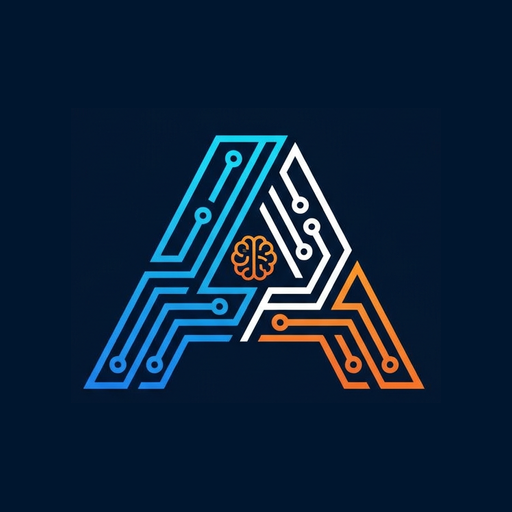

  

<h1 align="center">Ahmed Alhebshi</h1>

  <strong>AI Engineer & Software Developer</strong> 
  Building AI-powered products, scalable web platforms, and automation systems for real-world problems.

  <a href="https://ahmed-alhebshi.vercel.app">Portfolio</a>
  &nbsp;·&nbsp;
  <a href="https://www.linkedin.com/in/ahmed-alhabshi">LinkedIn</a>
  &nbsp;·&nbsp;
  <a href="mailto:a.alhabshi2002@gmail.com">Email</a>
  &nbsp;·&nbsp;
  <a href="https://github.com/AhmedAlhabshi?tab=repositories">Projects</a>

---

## About me

I am an Artificial Intelligence graduate from Bahçeşehir University with hands-on experience in software development, automation, and IT. I focus on turning technical ideas into useful products that solve clear business and user problems.

- Based in **Jeddah, Saudi Arabia** — available worldwide
- Interested in **AI engineering, full-stack development, and business automation**
- I work end to end: understand the need, design the solution, build it, test it, and improve it

## Featured builds

| Project | What it does | Focus |
| --- | --- | --- |
| [Misnad](https://github.com/AhmedAlhabshi/Misnad) | An AI-powered platform for analyzing complex financial contracts | LLMs, OCR, RAG · **AMAD FinTech Hackathon Finalist** |
| [Diamond Tools E-commerce](https://github.com/AhmedAlhabshi/diamond-tools-ecommerce) | A bilingual industrial e-commerce platform | Next.js, full-stack commerce, RTL |
| [Purchase Order Management](https://github.com/AhmedAlhabshi/PurchaseOrderWebsite) | A procurement system for creating, tracking, and receiving purchase orders | Business applications, workflow automation |
| Automated Booking System | Automates booking and customer-service workflows | n8n, webhooks, API integrations |
| [Fraud Detection](https://github.com/AhmedAlhabshi/Fraud_detection_Mlflow) | An end-to-end fraud detection and experiment-tracking system | Machine learning, MLflow, Hyperopt, FastAPI |

## Technical toolbox

**AI & data**  
Machine Learning · Deep Learning · LLM Integration · RAG · OCR · Prompt Engineering · TensorFlow · Data Processing

**Product engineering**  
React · Next.js · TypeScript · JavaScript · Tailwind CSS · Node.js · Express · FastAPI · REST APIs

**Data & automation**  
PostgreSQL · Supabase · Drizzle ORM · n8n · Webhooks · Google APIs · Workflow Automation

**Delivery**  
Git · GitHub · Vercel · Cloudflare

## What I value

- Product thinking before implementation
- Practical AI that goes beyond the demo
- Clear, maintainable systems
- End-to-end ownership and continuous improvement

---

  Open to AI engineering, software development, and product collaboration opportunities.

